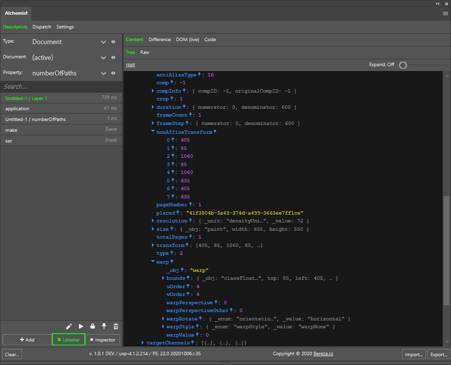

# Alchemist for Photoshop

## Alchemist panel

Listens all (most of) Photoshop events. Something like actions panel in Photoshop but for scripting. Or ScriptListener plugin for ExtendScript but in panel. Also can inspect PS DOM and show PS AM descriptors from various places.

Videos on how to use it from Davide Barranca series about UXP:
- #7 BatchPlay (part 2): the Alchemist listener https://www.youtube.com/watch?v=aZn_6X6nvUM
- #8 BatchPlay (part 3): the Alchemist inspector https://www.youtube.com/watch?v=qDw3mdGAG2o

Important links:
- How `batchPlay` works. Read before you code! https://developer.adobe.com/photoshop/uxp/2022/ps_reference/media/batchplay/

## Occultist panel
Can convert action files (.atn) into JSON and also into source code snippets.

Short demo: Convert Photoshop Action (.atn) files to UXP code with Alchemist https://www.youtube.com/watch?v=ve6awe_FOtY 

## Sorcerer panel
Can generate whole plugin based copy/pasted source code e.g. from Alchemist panel. It also can help you generate content of manifest.json file.
So you can convert action file into plugin very quickly. E.g. record action file (.atn) -> Read it as JSON via Occultist -> Pass it into Alchemist to generate source code -> Generate plugin from generated source code.

Video:  Generate plugin with Sorcerer panel https://www.youtube.com/watch?v=fhSy2nyK3Uk (tutorial)



## Versions
Alchemist 1.4.0 requires Photoshop 22.5 or higher.

Alchemsit 1.3.0 works best with Photoshop 22.4.x and lower.

Show all versions here: https://github.com/jardicc/alchemist/releases

## Disclaimer
You are using this software at your own risk. It is possible that Photoshop could crash if you ask Photoshop to do something unusual via Alchemist. So just save your work if you are concerned. 

## Difference between Marketplace and Development version
Feature to listen to all Photoshop events is available only in Development version. This is intentionally forbidden by Adobe in Production version of plugin. Alchemist tries to listen to as many events as possible but it might perform badly. If you don't need Listener then it doesn't matter which version you will use.

## Quick usage - Development version (Recommended)
In Photoshop enable Developer Mode `PS > Edit > Preferences > Plugins > Enable Developer Mode`.

Install "Adobe UXP Developer Tool" if not already installed. (Get it here: https://www.adobe.io/photoshop/uxp/devtool/#download ) 
Click add plugin button. And open `dist\manifest.json` in dialog. Then click "load" in actions. 

Please make sure to use **`dist`** folder and NOT **`uxp`** folder.

## Even quicker usage - Marketplace version  (Not preferred)
Download `installer/2bcdb900.ccx` installer file in https://github.com/jardicc/alchemist/raw/master/installer/2bcdb900.ccx And double click file in file explorer.

## Quickest usage - Marketplace version  (Not preferred)
You just click the button to add plugin automatically in Photoshop from Marketplace https://adobe.com/go/cc_plugins_discover_plugin?pluginId=2bcdb900&workflow=share

## Panel Entrypoints
The extension will be available in `Plugins > Alchemist > Alchemist` menu with the extension's name. This will open up a PS panel with your extension loaded in it.

## Plugin settings
I hope you won't need to do anything with that file but in case that something goes wrong it is here.
Panel settings for development version on Window can be found in: 
```
c:\Users\<AccountName>\AppData\Roaming\Adobe\UXP\PluginsStorage\PHSP\22\Developer\2bcdb900\PluginData\settings.json
```

or for marketplace version
```
c:\Users\<AccountName>\AppData\Roaming\Adobe\UXP\PluginsStorage\PHSP\22\Internal\2bcdb900\PluginData\settings.json
```


# Dev Setup
To enable UXP development and see your panels in Photoshop, you will need to enable that in Photoshop preferences.
`PS > Edit > Preferences > Plugins > Enable Developer Mode`

Install the dependencies:

```
npm install
```

Run webpack to bundle

```
npm build
# or "npm watch" to watch for file changes and rebuild automatically
```
Load plugin as described above in quick usage section.

## Debugging

In "Adobe UXP Developer Tool" click actions triple dot and click debug.

## Supporters
The Alchemist plugin for Photoshop was developed with support from the **Adobe Fund for Design**.

### Individual donors
- Pierre Guidera - https://github.com/pierreGuidera
- and other anonymous developers

Please let me know if you want your name here :-)

Visit this site if you want to donate: https://bereza.gumroad.com/l/alchemist

## Credits

- Plugin icon and logo: Petr Štefek - https://twitter.com/phobik
- Original inspiration and some derived components: https://github.com/zalmoxisus/redux-devtools-extension
- JSONViewer Component - Dave Vedder <veddermatic@gmail.com> http://www.eskimospy.com/
